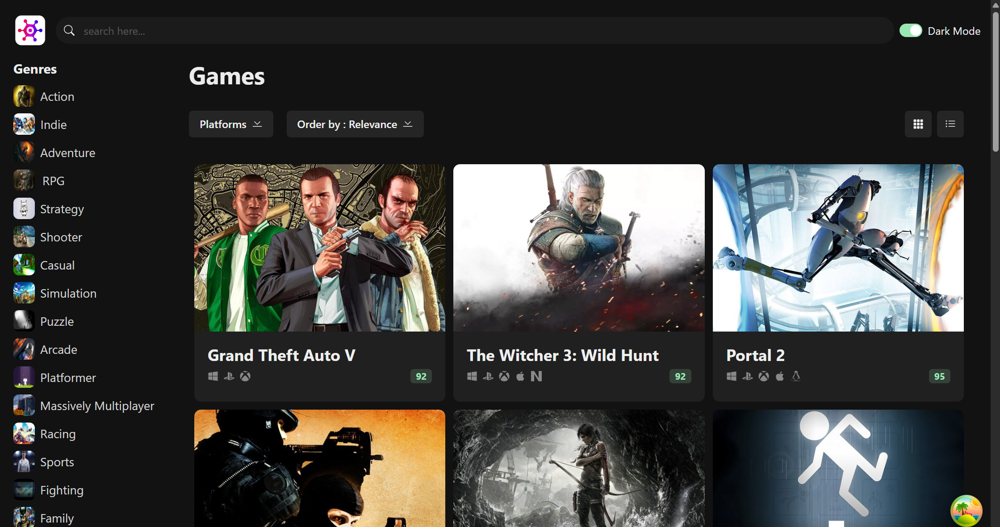

# 🎮 GameLoom

**A modern React-based game discovery interface** where users can explore games by genre, platform, and rating.

This project is designed to demonstrate front-end development skills, including:

- ✨ Clean and responsive UI/UX
- 🔍 Interactive filtering logic
- ⚙️ Dynamic data fetching and caching
- 📱 Mobile-first design principles

> Game data is powered by the [RAWG Video Games Database API](https://rawg.io/apidocs)

---

## 🔗 Live Demo

Check out the deployed app here:  
👉 [GameLoom Live on Vercel](https://game-loom.vercel.app/)

---

## 🚀 Tech Stack

This project uses a modern front-end development stack:

- **React.js** – UI library for building interactive interfaces  
- **TypeScript** – Static typing for improved developer experience  
- **Vite** – Lightning-fast development server and build tool  
- **Zustand** – Lightweight state management for UI state (filters, sorting, etc.)  
- **TanStack Query (React Query)** – Efficient data fetching and caching from the RAWG API  
- **Chakra UI** – Component library for accessible and responsive design  
- **React Icons** – Icon support from multiple libraries  
- **Axios** – Promise-based HTTP client for API requests  
---

## 📸 Screenshots
